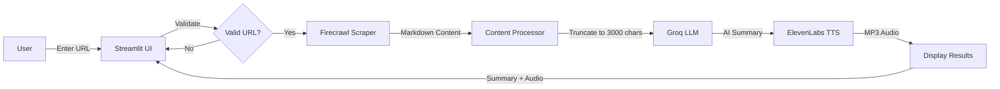

# 🎙️ AI Podcast Generator


An AI-powered web application that automatically converts blog posts into podcast episodes. Simply provide a blog URL, and the system will scrape the content, generate a concise AI summary, and create high-quality audio using text-to-speech technology.

🔗 **[Live Demo](https://your-app-name.streamlit.app)** | 📖 **[Documentation](#)** | 🐛 **[Report Bug](https://github.com/yourusername/podcast-generator/issues)**

---

## 📋 Table of Contents

- [Features](#features)
- [Demo](#demo)
- [Architecture](#architecture)
- [Tech Stack](#tech-stack)
- [How It Works](#how-it-works)
- [Quick Start](#quick-start)
- [Installation](#installation)
- [Configuration](#configuration)
- [Deployment](#deployment)
- [Usage](#usage)
- [API Keys](#api-keys)
- [Project Structure](#project-structure)
- [Troubleshooting](#troubleshooting)
- [FAQ](#faq)
- [Contributing](#contributing)
- [License](#license)

---

## ✨ Features

- 🌐 **Smart Web Scraping**: Extracts clean, structured content from any blog URL using Firecrawl
- 🤖 **AI-Powered Summarization**: Generates podcast-optimized 100-200 word summaries using Groq's Llama 3.1
- 🎵 **High-Quality Text-to-Speech**: Converts summaries into natural-sounding audio with ElevenLabs
- 🔒 **Secure Authentication**: Built-in username/password protection
- ⚡ **Lightning Fast**: Generates complete podcasts in 5-10 seconds
- 🎨 **Beautiful UI**: Clean, modern Streamlit interface
- 📥 **Download Ready**: Instant MP3 download of generated podcasts
- ☁️ **Cloud-Native**: Fully deployable on Streamlit Cloud (free tier)
- 🔑 **Secret Management**: Secure API key storage with Streamlit Secrets

---

## 🎬 Demo

### Login Screen
```
Username: aipodcast
Password: Welcome@2026
```

### Main Interface
1. Enter blog URL
2. Click "Generate Podcast"
3. View AI-generated summary
4. Listen to or download podcast audio

---

## 🏗️ Architecture

### High-Level System Design

```
┌─────────────────────────────────────────────────────────────────┐
│                    Streamlit Web Application                    │
│                      (User Interface Layer)                     │
│                    Authentication Protected                      │
└────────────────────────────┬────────────────────────────────────┘
                             │
                             │ Blog URL Input
                             ▼
┌─────────────────────────────────────────────────────────────────┐
│                   Application Logic Layer                       │
│                        (app.py)                                 │
│                                                                 │
│  ┌──────────────────────────────────────────────────────────┐  │
│  │           Request Orchestration                          │  │
│  │  • Input Validation                                      │  │
│  │  • Service Coordination                                  │  │
│  │  • Error Handling & Recovery                            │  │
│  │  • Progress Tracking                                     │  │
│  └──────────────────────────────────────────────────────────┘  │
└────────────────────────────┬────────────────────────────────────┘
                             │
        ┌────────────────────┼────────────────────┐
        │                    │                    │
        ▼                    ▼                    ▼
┌───────────────┐    ┌───────────────┐    ┌───────────────┐
│   Scraping    │    │ Summarization │    │  Audio Gen    │
│   Module      │    │    Module     │    │   Module      │
│               │    │               │    │               │
│ Firecrawl API │    │   Groq API    │    │ ElevenLabs    │
│               │    │               │    │     API       │
│ • Parse HTML  │    │ • Llama 3.1   │    │ • Flash v2.5  │
│ • Clean Text  │    │ • 8B Instant  │    │ • George      │
│ • Extract MD  │    │ • 300 tokens  │    │ • MP3 44kHz   │
└───────┬───────┘    └───────┬───────┘    └───────┬───────┘
        │                    │                    │
        │ Clean Content      │ Summary Text       │ Audio File
        ▼                    ▼                    ▼
┌─────────────────────────────────────────────────────────────────┐
│                      Output Presentation                        │
│                                                                 │
│  • Text Summary Display                                         │
│  • Audio Player Widget                                          │
│  • Download Button (MP3)                                        │
│  • Status Messages                                              │
└─────────────────────────────────────────────────────────────────┘
```

### Data Flow Diagram



### Processing Pipeline

```
┌─────────────┐    ┌──────────────┐    ┌─────────────┐    ┌──────────────┐
│   Input     │───▶│   Scraping   │───▶│  Processing │───▶│Summarization │
│  Blog URL   │    │  (Firecrawl) │    │  (Truncate) │    │   (Groq)     │
└─────────────┘    └──────────────┘    └─────────────┘    └──────────────┘
                          │                    │                   │
                          │                    │                   │
                          ▼                    ▼                   ▼
                    Raw HTML          Clean Markdown        Summary Text
                    (10KB+)            (~3000 chars)         (150-200 words)
                                                                   │
                                                                   ▼
                                                           ┌──────────────┐
                                                           │     TTS      │
                                                           │(ElevenLabs)  │
                                                           └──────────────┘
                                                                   │
                                                                   ▼
                                                             MP3 Audio File
```

---

## 🛠️ Tech Stack

### Core Technologies

| Component | Technology | Version | Purpose |
|-----------|-----------|---------|---------|
| **Language** | Python | 3.11+ | Main programming language |
| **Framework** | Streamlit | 1.52.2 | Web application framework |
| **Deployment** | Streamlit Cloud | Latest | Cloud hosting platform |

### AI/ML Services & APIs

| Service | Model/Version | Pricing | Function |
|---------|---------------|---------|----------|
| **Firecrawl** | Latest API | Free tier available | Web scraping & content extraction |
| **Groq** | Llama 3.1 8B Instant | Free: 6000 TPM | AI text summarization |
| **ElevenLabs** | Flash v2.5 | Free: 10K chars/month | Text-to-speech conversion |

### Python Dependencies

```python
streamlit==1.52.2       # Web UI framework
groq==1.0.0             # Groq API client for LLM
firecrawl-py==4.12.0    # Web scraping client
elevenlabs==2.27.0      # Text-to-speech client
python-dotenv==1.2.1    # Environment variable management
```

---

## 🔄 How It Works

### Detailed Step-by-Step Process

#### Phase 1: Content Extraction (Firecrawl)

```python
# Initialize Firecrawl client
scraper = FirecrawlApp(api_key=firecrawl_key)

# Scrape and clean content
scraped_result = scraper.scrape_url(url)
content = scraped_result.get('markdown', '')
```

**What happens:**
1. Firecrawl visits the blog URL
2. Parses HTML structure
3. Removes navigation, ads, sidebars, footers
4. Extracts main content as clean markdown
5. Returns structured, readable text

**Output:** Clean markdown text (typically 5,000-20,000 characters)

---

#### Phase 2: Content Optimization

```python
# Truncate to fit Groq free tier limits
max_chars = 3000
if len(content) > max_chars:
    content = content[:max_chars] + "..."
```

**Why this matters:**
- Groq free tier: 6,000 tokens/minute
- ~3,000 chars ≈ 750 tokens
- Leaves room for system prompts + response
- Ensures reliable processing

**Output:** Optimized content (≤3000 characters)

---

#### Phase 3: AI Summarization (Groq)

```python
client = Groq(api_key=groq_key)

response = client.chat.completions.create(
    messages=[
        {
            "role": "system",
            "content": "You are a content analyst. Create concise, "
                      "informative summaries suitable for podcast scripts."
        },
        {
            "role": "user",
            "content": f"Summarize the following blog post in "
                      f"100-200 words:\n\n{content}"
        }
    ],
    model="llama-3.1-8b-instant",
    temperature=0.7,
    max_tokens=300
)

summary = response.choices[0].message.content
```

**Model Configuration:**
- **Model:** Llama 3.1 8B Instant (fast, efficient)
- **Temperature:** 0.7 (balanced creativity/accuracy)
- **Max Tokens:** 300 (ensures 100-200 word summaries)
- **System Prompt:** Optimized for podcast-style content

**Output:** Podcast-ready summary (100-200 words)

---

#### Phase 4: Audio Generation (ElevenLabs)

```python
client = ElevenLabs(api_key=elevenlabs_key)

audio_stream = client.text_to_speech.convert(
    text=summary[:350],           # First 350 chars
    voice_id="JBFqnCBsd6RMkjVDRZzb",  # George voice
    model_id="eleven_flash_v2_5", # Fast generation
    output_format="mp3_44100_128" # High quality
)

# Save to file
with open("podcast_episode.mp3", "wb") as f:
    for chunk in audio_stream:
        f.write(chunk)
```

**Audio Specifications:**
- **Voice:** George (JBFqnCBsd6RMkjVDRZzb) - Natural, professional tone
- **Model:** Flash v2.5 - Optimized for speed
- **Format:** MP3
- **Sample Rate:** 44.1 kHz
- **Bitrate:** 128 kbps
- **Duration:** Typically 1-2 minutes

**Output:** High-quality MP3 audio file

---

## 🚀 Quick Start

### Prerequisites

- Python 3.11 or higher
- Git
- API Keys (see [API Keys](#api-keys) section)

### 5-Minute Setup

```bash
# 1. Clone the repository
git clone https://github.com/yourusername/podcast-generator.git
cd podcast-generator

# 2. Install dependencies
pip install -r requirements.txt

# 3. Create secrets file
mkdir .streamlit
cat > .streamlit/secrets.toml << EOF
GROQ_API_KEY = "your_groq_key_here"
FIRECRAWL_API_KEY = "your_firecrawl_key_here"
ELEVENLABS_API_KEY = "your_elevenlabs_key_here"
EOF

# 4. Run the app
streamlit run app.py
```

The app will open automatically in your browser at `http://localhost:8501`

**Login Credentials:**
- Username: `aipodcast`
- Password: `Welcome@2026`

---

## 📦 Installation

### Option 1: Local Development

#### Step 1: Clone Repository

```bash
git clone https://github.com/yourusername/podcast-generator.git
cd podcast-generator
```

#### Step 2: Create Virtual Environment (Recommended)

```bash
# Using venv
python -m venv venv

# Activate on Windows
venv\Scripts\activate

# Activate on macOS/Linux
source venv/bin/activate
```

#### Step 3: Install Dependencies

```bash
pip install -r requirements.txt
```

#### Step 4: Configure Secrets

Create `.streamlit/secrets.toml`:

```toml
GROQ_API_KEY = "gsk_your_groq_key_here"
FIRECRAWL_API_KEY = "fc-your_firecrawl_key_here"
ELEVENLABS_API_KEY = "your_elevenlabs_key_here"
```

#### Step 5: Run Application

```bash
streamlit run app.py
```

---

### Option 2: Using Docker (Coming Soon)

Docker deployment is being updated for the new Streamlit-based architecture.

---

## ☁️ Deployment

### Streamlit Cloud Deployment (Recommended)

Streamlit Cloud offers free hosting for Streamlit apps with automatic deployments from GitHub.

#### Step 1: Prepare Repository

Ensure your repository has:
- ✅ `app.py` (main application file)
- ✅ `blog_summarizer.py` (core logic)
- ✅ `requirements.txt` (dependencies)
- ✅ `README.md` (this file)

#### Step 2: Push to GitHub

```bash
git add .
git commit -m "Deploy to Streamlit Cloud"
git push origin main
```

#### Step 3: Deploy on Streamlit Cloud

1. Go to [share.streamlit.io](https://share.streamlit.io)
2. Sign in with GitHub
3. Click **"New app"**
4. Select your repository
5. Set **Main file path:** `app.py`
6. Click **"Deploy"**

#### Step 4: Configure Secrets

In Streamlit Cloud dashboard:

1. Click on your app
2. Go to **Settings** → **Secrets**
3. Add your API keys:

```toml
GROQ_API_KEY = "gsk_your_actual_groq_key"
FIRECRAWL_API_KEY = "fc-your_actual_firecrawl_key"
ELEVENLABS_API_KEY = "your_actual_elevenlabs_key"
```

4. Click **"Save"**

#### Step 5: Access Your App

Your app will be live at: `https://your-app-name.streamlit.app`

### Custom Domain (Optional)

Streamlit Cloud supports custom domains on paid plans. See [Streamlit documentation](https://docs.streamlit.io/) for details.

---

## 🔑 API Keys

### Required API Keys

You need three API keys to run this application. All have free tiers available.

### 1. Groq API Key 🚀

**Purpose:** AI text summarization using Llama 3.1 8B model

**Get it:**
1. Visit [console.groq.com](https://console.groq.com)
2. Sign up for free account
3. Go to **API Keys** section
4. Click **"Create API Key"**
5. Copy your key (starts with `gsk_`)

**Free Tier Limits:**
- 6,000 tokens per minute
- 14,400 requests per day
- Perfect for this application

---

### 2. Firecrawl API Key 🕷️

**Purpose:** Web scraping and content extraction

**Get it:**
1. Visit [firecrawl.dev](https://firecrawl.dev)
2. Sign up for free account
3. Navigate to API settings
4. Generate new API key
5. Copy your key (starts with `fc-`)

**Free Tier Limits:**
- Check current pricing on website
- Generous free tier for development

---

### 3. ElevenLabs API Key 🎵

**Purpose:** Text-to-speech audio generation

**Get it:**
1. Visit [elevenlabs.io](https://elevenlabs.io)
2. Create free account
3. Go to **Profile Settings**
4. Find **API Key** section
5. Copy your key

**Free Tier Limits:**
- 10,000 characters per month
- ~50-60 podcast episodes per month
- High-quality audio

---

## 📁 Project Structure

```
podcast-generator/
│
├── app.py                      # Main Streamlit application
│   ├── Authentication logic
│   ├── UI components
│   └── Workflow orchestration
│
├── blog_summarizer.py          # Core processing module
│   ├── Firecrawl integration
│   ├── Groq LLM integration
│   └── Content processing logic
│
├── requirements.txt            # Python dependencies
│   ├── streamlit
│   ├── groq
│   ├── firecrawl-py
│   ├── elevenlabs
│   └── python-dotenv
│
├── README.md                   # This file
│
├── .streamlit/                 # Streamlit configuration
│   └── secrets.toml           # API keys (local only)
│
├── .gitignore                 # Git ignore rules
│   ├── .streamlit/secrets.toml
│   ├── *.mp3
│   └── __pycache__/
│
└── Generated Files/            # Runtime generated
    └── podcast_episode.mp3    # Generated audio files
```

### File Descriptions

| File | Purpose | Lines | Complexity |
|------|---------|-------|------------|
| `app.py` | Main UI and orchestration | ~140 | Medium |
| `blog_summarizer.py` | Core AI processing | ~80 | Low |
| `requirements.txt` | Dependencies | ~5 | Simple |

---

## 🎯 Usage

### Web Interface

#### 1. Access Application

**Local:**
```
http://localhost:8501
```

**Cloud:**
```
https://your-app-name.streamlit.app
```

#### 2. Login

Enter credentials:
- **Username:** `aipodcast`
- **Password:** `Welcome@2026`

#### 3. Generate Podcast

1. **Enter blog URL** in the text input field
   - Example: `https://example.com/blog-post`
   
2. **Click "Generate Podcast"** button

3. **Wait for processing** (5-10 seconds)
   - 🔍 Scraping content...
   - ✅ Summary generated!
   - 🎵 Generating audio...
   - 🎉 Complete!

4. **View results:**
   - Read AI-generated summary
   - Play audio in browser
   - Download MP3 file

---

### Programmatic Usage

You can also use the core functionality programmatically:

```python
from blog_summarizer import summarize_blog

# Generate summary
url = "https://example.com/blog-post"
summary = summarize_blog(url)

print(summary)
# Output: "This article discusses..."
```

---

## 🔧 Configuration

### Customization Options

#### Change Voice

Edit `app.py` line 62:

```python
voice_id="JBFqnCBsd6RMkjVDRZzb"  # Change to your preferred voice

# Popular ElevenLabs voices:
# - "21m00Tcm4TlvDq8ikWAM" - Rachel (female, calm)
# - "AZnzlk1XvdvUeBnXmlld" - Domi (female, young)
# - "EXAVITQu4vr4xnSDxMaL" - Sarah (female, professional)
# - "ErXwobaYiN019PkySvjV" - Antoni (male, warm)
# - "MF3mGyEYCl7XYWbV9V6O" - Elli (female, energetic)
```

#### Adjust Summary Length

Edit `blog_summarizer.py` line 75:

```python
max_tokens=300  # Increase for longer summaries
# 300 tokens ≈ 150-200 words
# 500 tokens ≈ 250-350 words
```

#### Change AI Model

Edit `blog_summarizer.py` line 69:

```python
model="llama-3.1-8b-instant"  

# Other Groq models:
# - "llama-3.3-70b-versatile" (slower, higher quality)
# - "mixtral-8x7b-32768" (good balance)
```

#### Modify Content Truncation

Edit `blog_summarizer.py` line 50:

```python
max_chars = 3000  # Adjust based on your needs
# 3000 chars ≈ 750 tokens (safe for free tier)
# 6000 chars ≈ 1500 tokens (may hit limits)
```

#### Change Authentication

Edit `app.py` lines 18-21:

```python
if (
    st.session_state["username"] == "your_username"  # Change here
    and st.session_state["password"] == "your_password"  # And here
):
```

---

## 🐛 Troubleshooting

### Common Issues & Solutions

#### Issue 1: API Key Errors

**Error Message:**
```
Error: API keys not configured. Please add GROQ_API_KEY and 
FIRECRAWL_API_KEY to Streamlit secrets
```

**Solution:**
1. Check `.streamlit/secrets.toml` exists
2. Verify API keys are correctly formatted
3. Ensure no extra spaces or quotes
4. Restart Streamlit app

---

#### Issue 2: Blank Screen

**Symptoms:**
- App loads but shows nothing
- No error messages

**Solution:**
1. Check browser console for errors (F12)
2. Clear browser cache
3. Try incognito/private mode
4. Verify app.py is the main file

---

#### Issue 3: Scraping Fails

**Error Message:**
```
Error scraping blog with Firecrawl: [error details]
```

**Possible Causes & Solutions:**

| Cause | Solution |
|-------|----------|
| Invalid URL | Check URL format (must start with http:// or https://) |
| Blocked content | Try a different blog URL |
| API key invalid | Verify Firecrawl API key in secrets |
| Rate limit hit | Wait a few minutes and try again |

---

#### Issue 4: Audio Generation Fails

**Error Message:**
```
Summary generated but audio failed
```

**Solutions:**
1. **Check ElevenLabs API key** is correct
2. **Verify free tier limit** not exceeded (10K chars/month)
3. **Check summary length** - should be ≤350 characters for audio
4. **Try again** - temporary API issues

---

#### Issue 5: Token Limit Exceeded

**Error Message:**
```
Error: Request too large... Limit 6000
```

**This shouldn't happen** because content is truncated to 3000 chars.

**If it does:**
1. Reduce `max_chars` in `blog_summarizer.py` to 2000
2. Check if blog has unusual formatting
3. Report as bug on GitHub

---

### Debug Mode

Enable detailed logging:

```python
# Add to top of blog_summarizer.py
import logging
logging.basicConfig(level=logging.DEBUG)
```

---

## ❓ FAQ

### General Questions

**Q: Is this free to use?**  
A: Yes! All APIs have generous free tiers that are sufficient for personal use.

**Q: How long does it take to generate a podcast?**  
A: Typically 5-10 seconds from URL submission to audio playback.

**Q: What's the maximum blog length it can handle?**  
A: Unlimited! Content is automatically truncated to optimal length while preserving key information.

**Q: Can I use this for commercial purposes?**  
A: Yes, under Apache 2.0 license. Check individual API terms of service.

---

### Technical Questions

**Q: Why Streamlit instead of Gradio?**  
A: Streamlit Cloud offers better free hosting, easier deployment, and native secret management.

**Q: Can I run this offline?**  
A: No, it requires internet connection for API calls (Groq, Firecrawl, ElevenLabs).

**Q: Can I deploy this on other platforms?**  
A: Yes! Works on Heroku, AWS, Google Cloud, Azure, or any platform supporting Python.

**Q: How do I change the podcast voice?**  
A: See [Configuration](#configuration) section for voice customization.

---

### Limits & Quotas

**Q: How many podcasts can I generate per month?**  
A: With free tiers:
- Groq: ~14,400 per day
- Firecrawl: Check current limits
- ElevenLabs: ~50-60 episodes/month (10K chars)

**Bottleneck:** ElevenLabs free tier (10,000 characters/month)

**Q: Can I upgrade for more capacity?**  
A: Yes! All services offer paid plans with higher limits.

---

## 📊 Performance Metrics

| Metric | Value | Notes |
|--------|-------|-------|
| **Average Processing Time** | 5-10s | End-to-end |
| **Scraping Time** | 1-2s | Depends on blog |
| **Summary Generation** | 2-3s | Using Groq |
| **Audio Generation** | 2-5s | Using ElevenLabs |
| **Memory Usage** | ~150 MB | Streamlit app |
| **Concurrent Users** | 10-20 | Free tier limit |

---

## 🚀 Future Enhancements

### Planned Features

- [ ] 🌍 Multi-language support (Spanish, French, German)
- [ ] 📝 Custom summary length slider
- [ ] 🎙️ Voice selection dropdown
- [ ] 📂 Batch URL processing
- [ ] 💾 History/favorites system
- [ ] 🎨 Custom branding options
- [ ] 📊 Usage analytics dashboard
- [ ] 🔗 RSS feed generation
- [ ] 📱 Mobile app version
- [ ] 🎧 Spotify/Apple Podcasts integration

### Contributions Welcome!

See [Contributing](#contributing) section.

---

## 🤝 Contributing

We welcome contributions! Here's how:

### Getting Started

1. **Fork the repository**
   ```bash
   # Click "Fork" on GitHub
   ```

2. **Clone your fork**
   ```bash
   git clone https://github.com/your-username/podcast-generator.git
   cd podcast-generator
   ```

3. **Create a branch**
   ```bash
   git checkout -b feature/amazing-feature
   ```

4. **Make changes**
   - Follow existing code style
   - Add comments
   - Test thoroughly

5. **Commit changes**
   ```bash
   git commit -m "Add amazing feature"
   ```

6. **Push to GitHub**
   ```bash
   git push origin feature/amazing-feature
   ```

7. **Open Pull Request**
   - Go to GitHub
   - Click "Pull Request"
   - Describe your changes

### Contribution Guidelines

- ✅ Write clear commit messages
- ✅ Test on local Streamlit before PR
- ✅ Update README if needed
- ✅ Follow Python PEP 8 style guide
- ✅ Add comments for complex logic

---

## 📝 License

This project is licensed under the **Apache License 2.0**.

```
Copyright 2026 [Your Name]

Licensed under the Apache License, Version 2.0 (the "License");
you may not use this file except in compliance with the License.
You may obtain a copy of the License at

    http://www.apache.org/licenses/LICENSE-2.0

Unless required by applicable law or agreed to in writing, software
distributed under the License is distributed on an "AS IS" BASIS,
WITHOUT WARRANTIES OR CONDITIONS OF ANY KIND, either express or implied.
See the License for the specific language governing permissions and
limitations under the License.
```

See the [LICENSE](LICENSE) file for full details.

---

## 👥 Authors & Credits

### Main Developer
- **Your Name** - *Initial work* - [@yourusername](https://github.com/yourusername)

### Contributors
See the list of [contributors](https://github.com/yourusername/podcast-generator/contributors) who participated in this project.

---

## 🙏 Acknowledgments

Special thanks to:

- **[Groq](https://groq.com)** - For providing fast, free LLM inference
- **[Firecrawl](https://firecrawl.dev)** - For reliable web scraping API
- **[ElevenLabs](https://elevenlabs.io)** - For natural text-to-speech technology
- **[Streamlit](https://streamlit.io)** - For amazing web framework and free hosting
- **Open source community** - For inspiration and support

---

## 📧 Contact & Support

### Get Help

- 📖 **Documentation**: This README
- 🐛 **Bug Reports**: [GitHub Issues](https://github.com/yourusername/podcast-generator/issues)
- 💬 **Discussions**: [GitHub Discussions](https://github.com/yourusername/podcast-generator/discussions)
- 📧 **Email**: your.email@example.com

### Connect

- 🌐 **Website**: [yourwebsite.com](https://yourwebsite.com)
- 🐦 **Twitter**: [@yourusername](https://twitter.com/yourusername)
- 💼 **LinkedIn**: [Your Name](https://linkedin.com/in/yourprofile)

---

## 🔗 Related Projects

- [podcast-summarizer](https://github.com/example/podcast-summarizer) - Reverse: summarize podcasts to text
- [blog-to-video](https://github.com/example/blog-to-video) - Convert blogs to videos
- [ai-content-tools](https://github.com/example/ai-content-tools) - Collection of AI content tools

---

## 📈 Project Stats


---

## 🎯 Roadmap

### Version 1.0 (Current)
- ✅ Basic podcast generation
- ✅ Streamlit UI
- ✅ Authentication
- ✅ Cloud deployment

### Version 2.0 (Planned)
- ⏳ Multi-language support
- ⏳ Voice selection
- ⏳ Batch processing
- ⏳ Usage analytics

### Version 3.0 (Future)
- 📋 RSS feed support
- 📋 Podcast platform integration
- 📋 Mobile app
- 📋 API endpoint

---

<div align="center">

**⭐ Star this repo if you find it useful!**

Made with ❤️ and AI

[Report Bug](https://github.com/yourusername/podcast-generator/issues) · 
[Request Feature](https://github.com/yourusername/podcast-generator/issues) · 
[Documentation](https://github.com/yourusername/podcast-generator/wiki)

</div>
